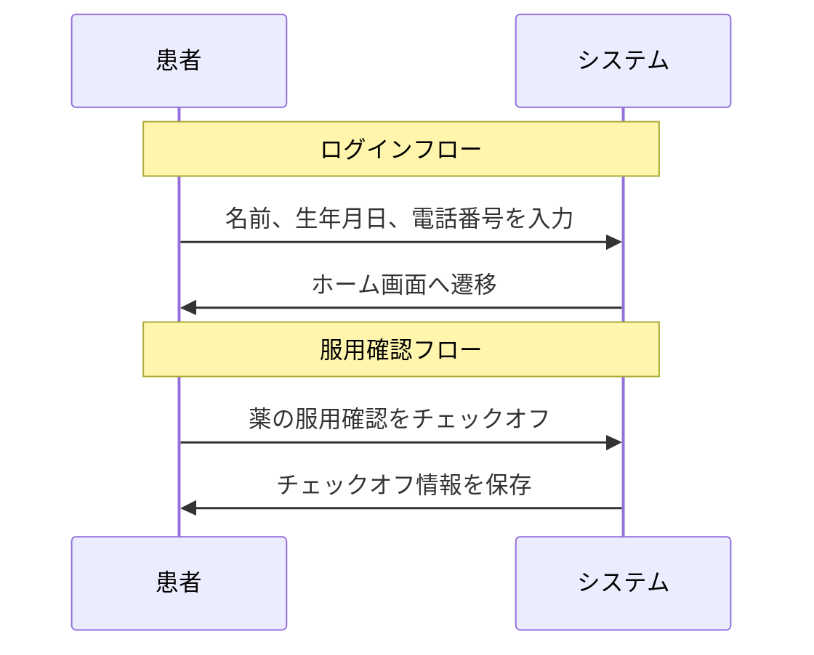
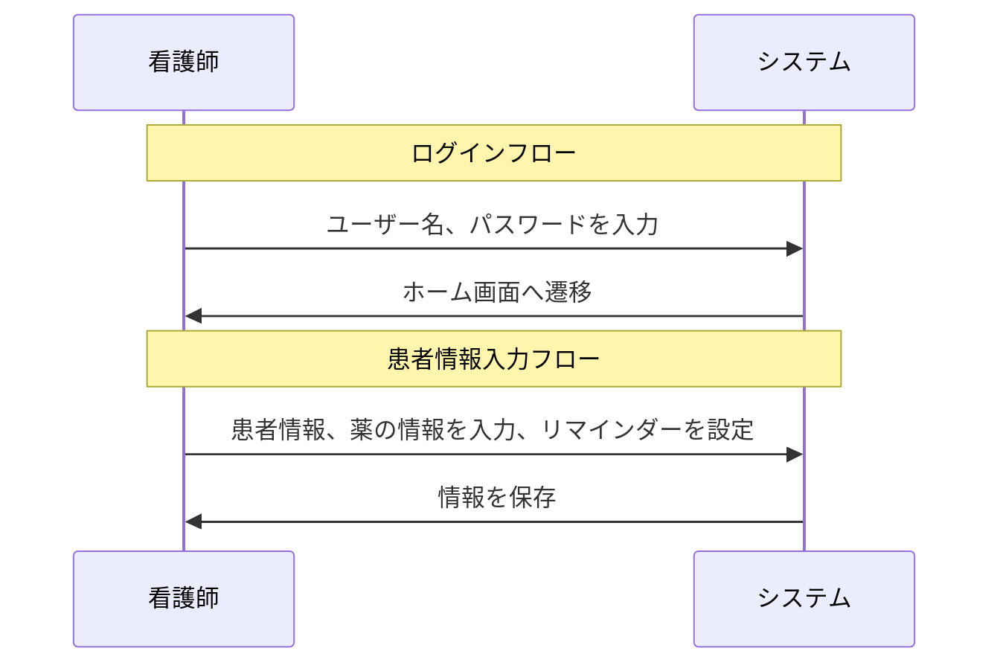

# 業務フロー

## **患者**

```mermaid
sequenceDiagram
participant 患者 as 患者
participant システム as システム
Note over 患者,システム: ログインフロー
患者->>システム: 名前、生年月日、電話番号を入力
システム->>患者: ホーム画面へ遷移
Note over 患者,システム: 服用確認フロー
患者->>システム: 薬の服用確認をチェックオフ
システム->>患者: チェックオフ情報を保存

```

## **看護師**

```mermaid
sequenceDiagram
participant 看護師 as 看護師
participant システム as システム
Note over 看護師,システム: ログインフロー
看護師->>システム: ユーザー名、パスワードを入力
システム->>看護師: ホーム画面へ遷移
Note over 看護師,システム: 患者情報入力フロー
看護師->>システム: 患者情報、薬の情報を入力、リマインダーを設定
システム->>看護師: 情報を保存

```
