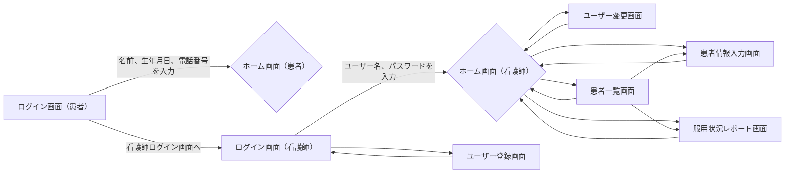

# 画面遷移図

```mermaid
graph LR
A["ログイン画面（患者）"] -- "名前、生年月日、電話番号を入力" --> B{"ホーム画面（患者）"}
A -- "看護師ログイン画面へ" --> C["ログイン画面（看護師）"]
C -- "ユーザー名、パスワードを入力" --> D{"ホーム画面（看護師）"}
D --> E["患者情報入力画面"]
E --> D
C --> F["ユーザー登録画面"]
D --> G["ユーザー変更画面"]
D --> H["患者一覧画面"]
D --> I["服用状況レポート画面"]
F --> C
G --> D
H --> D
I --> D
H --> E
H --> I

```
